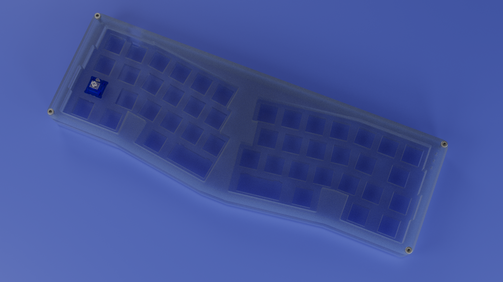
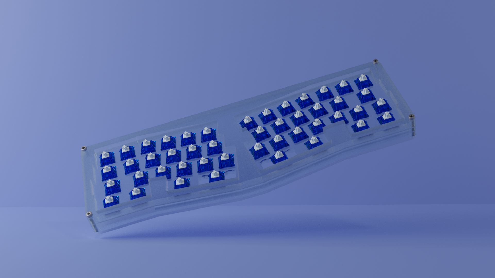
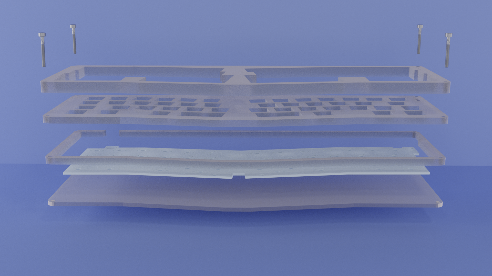
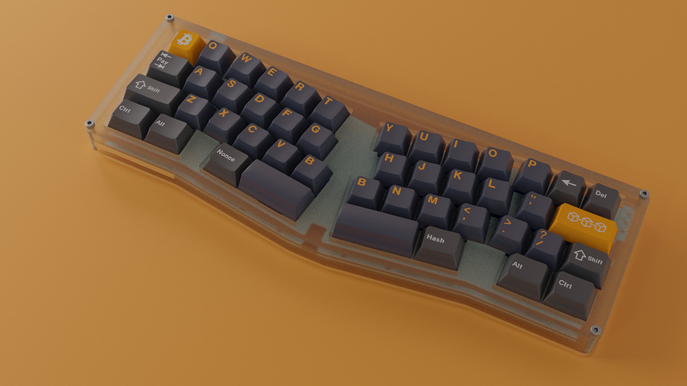

# IkCase

_A 45% Alice Acrylic Case_

_Stacked Acrylic Case for layouts like Prime-E and Prime-Elise_

The goal of this project is to offer an alternative to the original Prime Keyboard case. The principal difference between this alternative and the original files, is the angle mod at the bottom of the case, trying to replicate the TGR Alice case. This alternative has also some measurements modifications to get the best fit between the PCB and the case.

You can find Prime Keyboard's original case files [here](https://cdn.shopify.com/s/files/1/2016/1211/files/Prime_E_2D.zip?159).

## Layout:

- **Fixed Layout**: 1.25U Tab, 1.75U left Shift, 1.25U bottom row modifiers, 2.00U left space bar, 2.25U right space bar, 1.25U right shift and 1.75U enter. 

##### Backspace Options:

1. **Split Backspace**: 2x 1.00U keys (like the renders). 

2. **2u Backspace**: 1x 2.00U stab key. *Check [#feat-2uBrackspace](https://github.com/ikcoin/IkCase/tree/feat-2uBackspace) branch for this option.*

---

## Acrilic Layers

The case is made with 4 layers of acrylic that are stacked on top of each other and held together with 4 **M3** screws (screw holes are 3mm diameter). 
Note that this case has been developed for a PCB that has the **USB underneath of the PCB**. This case **won't fit with a PCB that has the USB on top**. 

- **Top**: The top piece of the case. The ideal thickness is 8mm (8 millimetres), and because it is not easy (and cheap) to find a 8mm thick acrylic piece, a good alternative could be 1x 3mm and 1x 5mm to get the 8mm. 

- **Plate**: This is the switchplate of the keyboard. Will hold the switches and the ideal thickness is 5mm (5 millimetres). 

- **Mid**: This piece is placed between the plate and the base piece to offer space to the PCB and the ideal thickness is 5mm (5 millimetres). 

- **Base**: The bottom piece that closes the case. The ideal thickness is 3mm (3 millimetres). Like **Mid** piece, has the USB port exit. 

---
## Final Prototype

